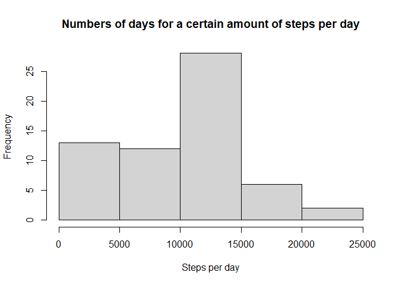
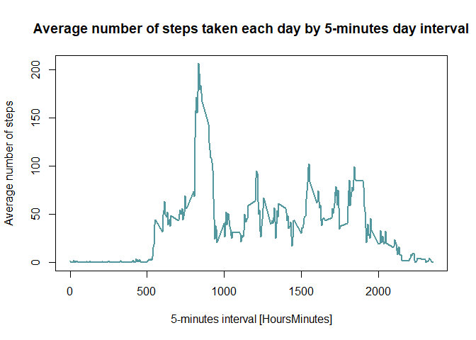
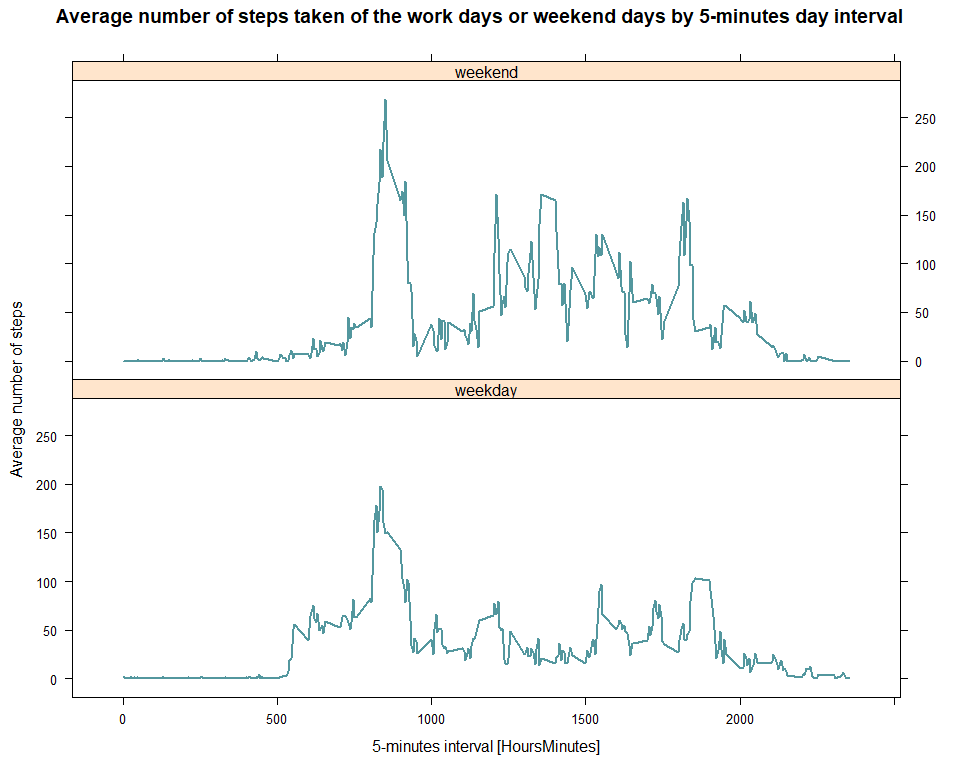

Set future code chunks to always be visible :


```r
library(knitr)
opts_chunk$set(echo = TRUE)
```


## Loading and preprocessing the data

### Raw data

Read and store data :

```r
activitydf <- read.csv(unzip("activity.zip"))
```


Preview of raw data :

```r
str(activitydf)
```

```
## 'data.frame':	17568 obs. of  3 variables:
##  $ steps   : int  NA NA NA NA NA NA NA NA NA NA ...
##  $ date    : chr  "2012-10-01" "2012-10-01" "2012-10-01" "2012-10-01" ...
##  $ interval: int  0 5 10 15 20 25 30 35 40 45 ...
```

```r
head(activitydf, n =3)
```

```
##   steps       date interval
## 1    NA 2012-10-01        0
## 2    NA 2012-10-01        5
## 3    NA 2012-10-01       10
```

```r
tail(activitydf, n =3)
```

```
##       steps       date interval
## 17566    NA 2012-11-30     2345
## 17567    NA 2012-11-30     2350
## 17568    NA 2012-11-30     2355
```


### Formated data

Format into date type to the concerned variable :

```r
library(dplyr)
activitydf$date <- strptime(activitydf$date, "%Y-%m-%d")
str(activitydf)
```

```
## 'data.frame':	17568 obs. of  3 variables:
##  $ steps   : int  NA NA NA NA NA NA NA NA NA NA ...
##  $ date    : POSIXlt, format: "2012-10-01" "2012-10-01" ...
##  $ interval: int  0 5 10 15 20 25 30 35 40 45 ...
```


## What is mean total number of steps taken per day?

Histogram of the total number of steps taken each day :

```r
temp <- activitydf %>% group_by(date) %>%
      summarise(stepsperday = sum(steps, na.rm = TRUE))
hist(temp$stepsperday,
     xlab = "Steps per day",
     main = "Numbers of days for a certain amount of steps per day")
```

<!-- -->


Mean and median of the total number of steps taken per day :

```r
temp %>%
      summarise(mean.stepsperday = mean(stepsperday, na.rm = TRUE),
                median.stepsperday = median(stepsperday, na.rm = TRUE)) %>%
      as.data.frame
```

```
##   mean.stepsperday median.stepsperday
## 1          9354.23              10395
```


## What is the average daily activity pattern?

Time series plot of the 5-minute interval and the average number of steps taken, averaged across all days :

```r
activitydf %>% group_by(interval) %>% 
      summarise(mean(steps, na.rm = TRUE)) %>%
      plot(type = 'l', col = "#53979E", lwd = 2,
           xlab = "5-minutes interval [HoursMinutes]", ylab = "Average number of steps",
           main = "Average number of steps taken each day by 5-minutes day interval")
```

<!-- -->


5-minute interval, on average across all the days in the dataset, containing the maximum number of steps :

```r
temp <- activitydf %>% group_by(interval) %>% 
      summarise(avg = mean(steps, na.rm = TRUE))

temp$interval[which(max(temp$avg) == temp$avg)]
```

```
## [1] 835
```


## Imputing missing values

Number of NAs in the dataset :

```r
sum(is.na(activitydf))
```

```
## [1] 2304
```


Filling missing "steps" values with median "steps" calculated for all days by "interval" :

```r
filt <- is.na(activitydf$steps)
filling <- activitydf %>% group_by(interval) %>% 
      summarise(med = median(steps, na.rm = TRUE))
```

```
## `summarise()` ungrouping output (override with `.groups` argument)
```

```r
processdf <- activitydf
processdf[filt, "steps"] <- filling$med[filling$interval == processdf[filt, "interval"]]
```


Histogram of the total number of steps taken each day :

```r
temp <- processdf %>% group_by(date) %>%
      summarise(stepsperday = sum(steps, na.rm = TRUE))
hist(temp$stepsperday,
     xlab = "Steps per day",
     main = "Numbers of days for a certain amount of steps per day")
```

<!-- -->


Mean and median of the total number of steps taken per day :

```r
processdf %>% group_by(date) %>%
      summarise(stepsperday = sum(steps, na.rm = TRUE)) %>%
      summarise(mean.stepsperday = mean(stepsperday, na.rm = TRUE),
                median.stepsperday = median(stepsperday, na.rm = TRUE)) %>%
      as.data.frame
```

```
##   mean.stepsperday median.stepsperday
## 1         9372.934              10395
```

With this NAs filling strategy :  
* histogram seems identical from the previous  
* the mean value is the same as before (10395 steps)  
* the median value is a little lower (before / after = 9354.23 / 9372.934 steps)  

## Are there differences in activity patterns between weekdays and weekends?


```r
library(lubridate)
library(lattice)
processdf <- processdf %>% mutate(wd = factor(wday(date), labels = c(rep("weekday", 5), rep("weekend", 2))))
temp <- processdf %>% group_by(wd, interval) %>% 
      summarise(avg = mean(steps, na.rm = TRUE))
xyplot(avg ~ interval | wd, data = temp,
       layout = c(1,2), type='l', col = "#53979E", lwd = 2,
       xlab = "5-minutes interval [HoursMinutes]", ylab = "Average number of steps",
       main = "Average number of steps taken of the work days or weekend days by 5-minutes day interval")
```

<!-- -->

